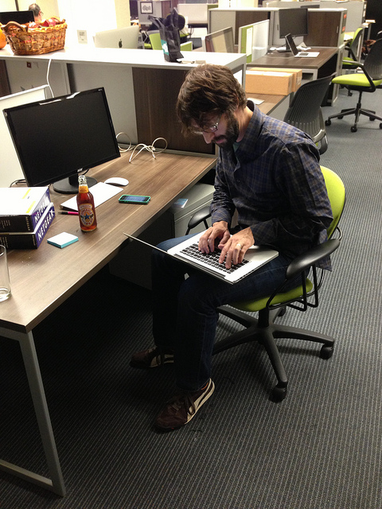
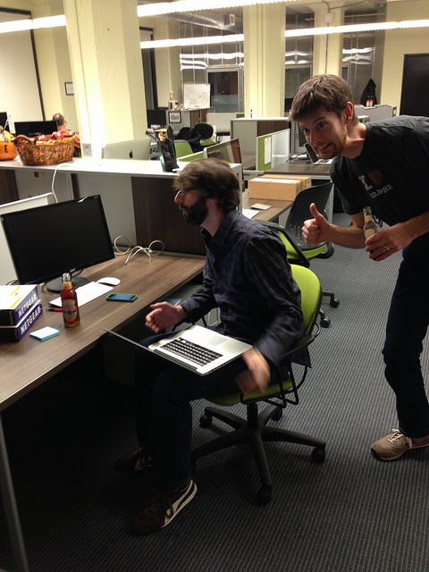
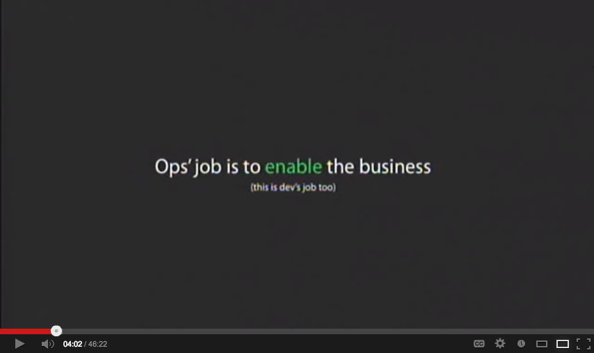

<!SLIDE title-slide>

# Monitoring - Not Just For Numbers

### Mikhail Panchenko

### SF Metrics Meetup 09/09/2013

<!SLIDE>

# Hi!

My name is Pancakes.

I work @ **Opsmatic**

.notes I am working on better tools for operators at a company called Opsmatic.
This talk isn't really about that company, but it's about the thought process
that motivated us to start it and has guided our direction.

<!SLIDE>

.notes Jay and I decided we wanted to work on something related to ops and
infrastructure. Little known fact: before Digg and all his social media glory,
Jay worked on network infra at NetCom &amp; PAIX, then co-founded Equinix. He
knows more about ops and networks than I think most people realize. And here he
is, for added credibility, fixing the failover routing configuration on a Cisco
Catalyst during an event at Founder's Den.

<!SLIDE>

.notes And here's Richard Crowley being hilarious. He's right back there if you
want any photobombing tips afterwards.

<!SLIDE>

.notes So we started thinking about what problems we'd come across in our
experiences so far that we could help solve in a generic way. What tasks and
problems had been demoralizing and distracting?

<!SLIDE>

<small>From Velocity 2009 [10+ Deploys Per Day: Dev and Ops Cooperation at Flickr](http://www.youtube.com/watch?v=LdOe18KhtT4)</small>

.notes But in order to know what was in the way, you have to think about what
it is you WANT to be doing. So we come back to what the role of the Ops team is,
and this whole DevOps thing. So Allspaw told us in 2009 that the job of Ops is
"Enable the Business." Sometime after that DevOps as a movement came to be, and
people started to realize that it's actually EVERYONE's job to enable the
business. So now we have fields like marketing looking into DevOps ways of
thinking. It's great!

<!SLIDE>

# DevOps ~= Get Shit Done

.notes However, one thing that I personally think we've lost sight of along the
way, is that Paul and John were actually encouraging people to put less weight
into the distinction between engineering and ops. For many people, "DevOps" has
simply replaced "Ops" as an evolution of that particular role. For the rest of
this talk, I'm just going to talk about dev and ops as one thing with common
goals.

<!SLIDE bullets>
# Happy
* 
    * Customers comfortably use the product
    * Product evolves to attract new users
        * Preferably faster than competitors
    * ???
    * Profit

.notes So as technical staff - what does that mean for us? 

<!SLIDE bullets>
# Sad
* 
    * Product is frequently down/slow
    * Changes make it worse
    * Tech teams spend all their time fighting fires and each other

.notes Broadly speaking, when we're dealing with unexpected contingencies, we're
by definition in tactical mode - we can only think short term. When we have the
ability to take a breath and settle down, we can get into tactical mode and
actually create something new, something NICE; maybe even anticipate the next few
surprises and put in place some safeguards.

<!SLIDE>

# Surprises = Bad

.notes So one thing that makes us sad across the board is surprises. They're
what keeps us in firefighting mode.

<!SLIDE>

# We've Come a Long Way

( logos of puppet, chef, cfengine, burgess's book )

.notes We've got quite a few ways to reduce surprises, all inspired by the idea
of convergent operators enforcing a policy. 
<!SLIDE>

# Introducing the Million Dollar Question

.notes Having a ready-fire answer to this question helps avoid surprises and
helps resolve them quickly when they do come up. And the question is...

<!SLIDE>

# What's Different?

.notes this is the most important, time consuming question. Differences between
hosts, environments, and clusters are the most dumbfounding source of surprises
\- especailly when differences happen outside of what's controlled by policy.
Policy certainly goes a long way for the things you know are important. But
trust me, you don't know all the things that are important.

<!SLIDE>

<small>From Brendan Gregg's post [Modes and Modality](http://dtrace.org/blogs/brendan/2013/07/08/modes-and-modality/)</small>

.notes We are perpetually answering this question using monitoring. Here's an
example from Brendan Gregg's post on using percentiles to identify interesting
patterns in traffic. Begs the question: "What's different about those two
paths?"

<!SLIDE>

<small>From Etsy's post [Introducing Kale](http://codeascraft.com/2013/06/11/introducing-kale/)</small>

.notes Etsy, ever on the forefront of tooling, have released some tools for
helping flag anomalous metrics - "Show me when things are different more
quickly."

<!SLIDE>

# What Has Changed?

.notes This is a special case of "What's different" because it involves time,

<!SLIDE quotation>

"One of the scariest things I ever encounter is a server that’s been running
for ages which has seen multiple upgrades of system and application
software."

Chad Fowler

.notes The reason that old server is so scary is that noone knows **what's
different** about it anymore. Lots of things have probably changed that are
outside the policy. Drift is pervasive, especially in fast moving environments
where the surface area for bugs and failures is vast. This leads to an erosion
of confidence and, more importantly, trust.

<!SLIDE>

# Machines Drift
# No Matter What

.notes The important thing to note is that the causes for drift are often
actually good things; it's a natural byproduct of Getting Shit Done. So what if
we just assumed that drift was a fact of life? In fact, what if we allowed for a
second that some drift was healthy? How would our tools differ if we thought
this way?

<!SLIDE>

 

.notes This tweet sparked a good (and now impossible to find) discussion on
Twitter, some of which is captured by a John Vincent blog post. I blurred out
Cliff's avatar just to be extra safe.

<!SLIDE>

# What even IS drift?

<!SLIDE>

# Drift is deviation from expectations
# which occurs over time

.notes Expectations are what surprises are made of. A lot of expectations are
implicit; they're our assumptions about the environment.

<!SLIDE bullets>

# Expectations
* 
    * Assumption: System libs ARE all be the same
    * Assertion: apache SHOULD be version 2.2.20

.notes The fact that "expectations" is such a broad term is important. Note that
one of these expectations is very broad, and the other is very specific. The
specific ones usually find their way into "policy." The broad ones do not.

<!SLIDE>

# Subtle Differences Outside Policy Scope

# ==

# Drift

.notes It can be a package version. Or a config value. Or an env var. Or a BIOS
setting. Or a kernel configuration value. Or a kernel module. Or a kernel module
version.

<!SLIDE>

# Targetted Partial CM Runs

# ==

# Drift

<!SLIDE>

# Changes Made During Outage

# ==

# Drift

.notes when you just don't have the time to bother with your actual CM process.
This, by the way, is called "Real Life." Every company I've talked to about this
has admitted that they frequently turn off CM on a machine during an outage. CM
erasing the changes you're making to try and fix something is the worst kind of
surprise.

<!SLIDE>

# Varying Hardware Configuration

# ==

# Drift

.notes most folks that have stressed EC2 are in the somber club of people that
have to pay attention to which processor the host underlying their VMs is
running.  But it's even more obnoxious than that - the same vendor may send you
two boxes of the same model with subtly varying BIOS settings. All that stuff is
important, and will eventually show up as a heisenbug.

<!SLIDE>

# Drift happens inside and outside "policy"

<!SLIDE>

# Drift is difficult to find.

<small>Photo by <a href="http://www.flickr.com/photos/alex_la/8512982319">alex_la</a></small>

.notes Drift is usually a small set of differences. A bump on a massive surface
area.  I dare you to come up with a better metaphor than shaving a yak. "Here's
this big hairy yak. Somewhere on this yak is a pimple. Go find it."

<!SLIDE>

# ... But not for a computer!

.notes Turns out computers are excellent at dealing with piles of structured
data, and ARE THEMSELVES piles of structured data. Package lists, service lists,
sysctl values, bios settings..

<!SLIDE>

# Drift is meaningless without a baseline

.notes Fortunately, baselines are all around you. The roles/clusters/runlists in
your CM tool. "How things were yesterday." _TODO_ expand

<!SLIDE bullets>
# Drift is meaningless without context

* 
    * What changed?
    * When did it change?
    * What else was happening?
    * Who performed the change?

.notes Computers are not as good at figuring out the "why" but they're pretty
good at helping figure out who might know.

<!SLIDE>

# HEY! This is supposed to be

# about monitoring!

<!SLIDE>

# Monitoring Is The Answer

<!SLIDE quotation>

"Control → Predictability + Interaction

...

Certainty → Knowledge + Information

where knowledge is a relationship to **the
history of what we’ve already observed in the past,** i.e. an expectation of
behaviour, and information is evidence of the present: that things are
proceeding as expected."

Mark Burgess. "In Search of Certainty" (emphasis mine)

.notes As if on cue, Mark Burgess published his book which is just chock-full of
great quotations for a talk like this.  Control and certainty allow us to be
productive and strategic. So how can we get there?

<!SLIDE bullets>
# My Dream
* 
    * Ongoing **MONITORING** of infrastructure state
        * categorical data, hence "not just for numbers"
        * keep history, an audit trail
    * Ability to compare states (find the pimple)
        * across hosts
        * across time
    * Put computer activity in human context
        * Who, what, when
    * Ability to detect + flag drift

<!SLIDE bullets>
# My Dream, Bonus
* 
    * Exceptions, subroles, rollback
    * Propagate changes across nodes
        * Help me write my infrastructure-as-code

.notes Essentially, CM integrated with this stream of activity and wealth of
data.

<!SLIDE>

# This dream takes a lot of work

Send your dreams and usecases to **pancakes@opsmatic.com**

Let us know if this is also your dream **jobs@opsmatic.com**

<!SLIDE>

# Thank You!

.notes Quesitons?
