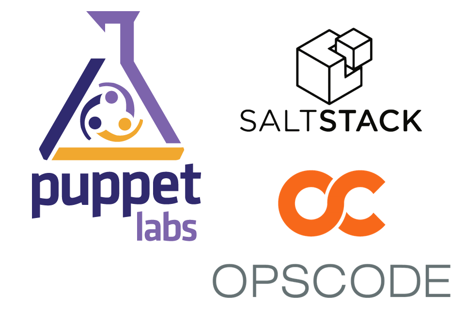
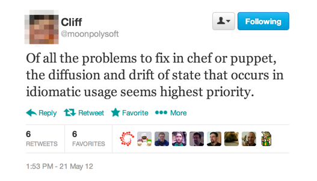
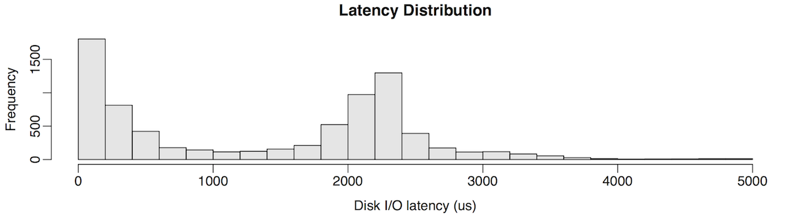
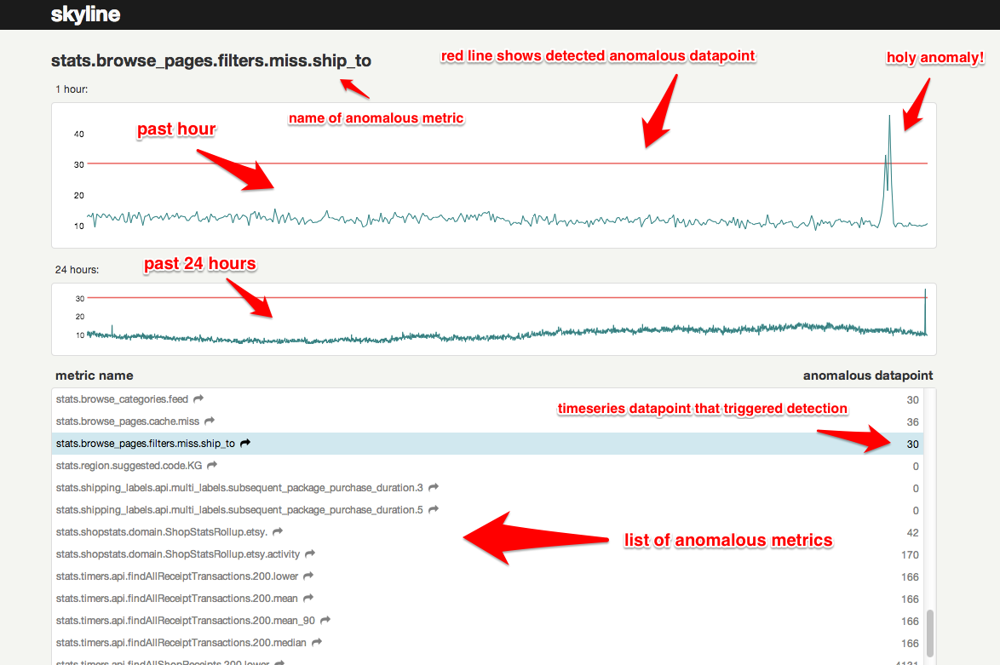
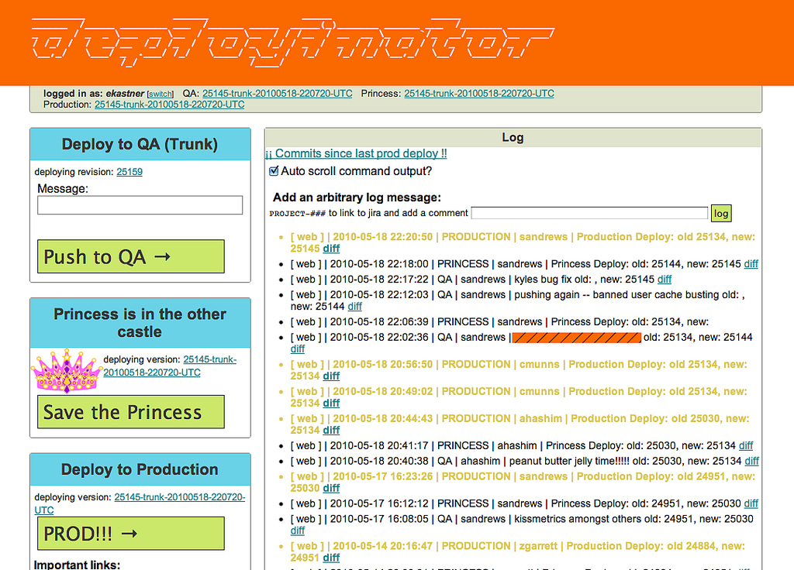

<!SLIDE>

<small>Photo by [s.benno](http://www.flickr.com/photos/9115274@N05/577382652)</small>

.notes We've been thinking about problems we'd come across in our experiences so
far that we could help solve in a generic way. What tasks and problems had been
demoralizing and distracting? What situations left us longing for better tools
and made us feel like we were using our time poorly?

<!SLIDE>

# DevOps ~= Get Shit Done

.notes I'm going to talk about Dev and Ops as a combined entity with the same
goals - or what I take DevOps to mean in the first place. These are not just Ops
problems. They are problems for any tech org as a whole, and we'll see why in a
second.

<!SLIDE bullets>
# Happy
* 
    * Customers comfortably use the product
    * Product evolves to attract new users
        * Preferably faster than competitors
    * ???
    * Profit

.notes So as technical staff - what does success look like? When we're in this
virtuous cycle, we are able to think strategically, prepare ourselves well for
upcoming releases, communicate and document things effectively, and feel like
we're doing something rewarding.

<!SLIDE bullets>
# Sad
* 
    * Product is frequently down/slow
    * Changes make it worse
    * Tech teams spend all their time fighting fires and each other

.notes When we're dealing with unexpected contingencies, we're by definition in
tactical mode - we can only think short term. We don't have the time, energy, or
organizational confidence for any of the things on the Happy slide.

<!SLIDE>

# Surprises = Bad

.notes Surprises are the enemy of strategy. They're what keeps us in
firefighting mode.

<!SLIDE>

# We've Come a Long Way

.notes We've got quite a few ways to reduce surprises, all inspired by the idea
of convergent operators enforcing a policy. But there's a lot more work to do.

<!SLIDE>

 

<small>Relevant John Vincent blog post: <a href="http://blog.lusis.org/blog/2012/05/24/configuration-drift-and-next-gen-cm/">Configuration
Drift and Next-gen CM</a></small>

.notes This tweet sparked a good (and now impossible to find) discussion on
Twitter, some of which is captured by a John Vincent blog post. Now, note that
Cliff had Joe Williams, certainly a chef power user, and some other very smart
folks working on their infrastructure. He's certainly not alone in his
frustration, so what could possibly be going wrong? Here are some examples.

<!SLIDE>

# Subtle Differences Outside Policy Scope

# <em>SURPRISE!</em>

.notes It can be a package version. Or a config value. Or an env var. Or a BIOS
setting. Or a kernel configuration value. Or a kernel module. Or a kernel module
version. At **SimpleGeo** we had this great bug in the distributed spatial
database we built on top of Cassandra. 4 of 9 nodes exhibited this bizarre
behavior where the JVM would get stuck in a "stop the world" pause for multiple
minutes at a time. The nodes became completely inaccessible during this time
(including over ssh). So we thought it was probably a bug in our experimental
software which we wrote on top of other arguably experimental software. We spent
all this time instrumenting the service and the JVM, and eventually were able to
get a little reproducer program that made it very clear that it was not our
software - the triggering conditions were just too simple and basic. So then
what was it? It wasn't specific to a particular EC2 AZ, or a specific hardware
configuration on the underlying hosts (which would have been a familiar
narrative). In a moment of despair, I ran `dpkg -l` on all the hosts and diffed
the results. It was fucking libc! SURPRISE!

<!SLIDE>

# Subtle Differences Outside Policy Scope
# Targetted Partial CM Runs

# <em>SURPRISE!</em>

.notes This is the usecase that John's blog post is about. If you're one of the
many people that have stopped running your CM tool in a cron (most users,
according to my anecdotal evidence), you probably only run it when you need to
"deploy" something. So if you "deploy" to your web cluster, then change a bunch
of ACLs or other base system type settings, then deploy something to your db
cluster, those settings are now different on those 2 clusters, and one of them
should likely be considered out of date. SURPRISE!

<!SLIDE>

# Subtle Differences Outside Policy Scope
# Targetted Partial CM Runs
# Changes Made During Outage

# <em>SURPRISE!</em>

.notes when you just don't have the time to bother with your actual CM process.
This, by the way, is called "Real Life." Every company I've talked to about this
has admitted that they frequently turn off CM on a machine during an outage. CM
erasing the changes you're making to try and fix something is the worst kind of
surprise. 

<!SLIDE>

# Subtle Differences Outside Policy Scope
# Targetted Partial CM Runs
# Changes Made During Outage
# Varying Hardware Configuration

# <em>SURPRISE!</em>

.notes most folks that have stressed EC2 are in the somber club of people that
have to pay attention to which processor the host underlying their VMs is
running.  But it's even more obnoxious than that - the same vendor may send you
two boxes of the same model with subtly varying BIOS settings or drives from
different brands or different lots which end up with somewhat differing
performance profiles. All that stuff is important, and will eventually show up
as a heisenbug.

<!SLIDE>

# Introducing the Million Dollar Question

.notes So with these sorts of surprises and pitfalls awaiting at every corner,
there's a particular question that becomes very important. Having a ready-fire
answer to this question helps avoid surprises and helps resolve them quickly
when they do come up. And the question is...

<!SLIDE>

# What's Different?

.notes This is the most important, time consuming question. Differences between
hosts, environments, and clusters are the most dumbfounding source of surprises
\- especailly when differences happen outside of what's controlled by policy.
Policy certainly goes a long way for the things you know are important. But
trust me, you can never know everything that's important - the domain is just
too big.

<!SLIDE>

# What Has Changed?

.notes This is a special case of "What's different" because it involves time,

<!SLIDE quotation>

"One of the scariest things I ever encounter is a server that’s been running
for ages which has seen multiple upgrades of system and application
software."

Chad Fowler

.notes The reason that old server is so scary is that noone knows **what's
changed**. Lots of things have probably changed that are outside the policy.
Drift is pervasive, especially in fast moving environments where the surface
area for bugs and failures is vast. This leads to an erosion of confidence and,
more importantly, trust.

<!SLIDE>

# Machines Drift
# No Matter What

.notes The important thing to note is that the causes for drift are often
actually good things; it's a natural byproduct of Getting Shit Done. So what if
we just assumed that drift was a fact of life? In fact, what if we allowed for a
second that some drift was healthy? How would our tools differ if we thought
this way?

<!SLIDE>

# What even IS drift?

<!SLIDE>

# Drift is deviation from expectations
# which occurs over time

.notes Expectations are what surprises are made of. A lot of expectations are
implicit; they're our assumptions about the environment.

<!SLIDE bullets>

# Expectations
* 
    * **Assumption**: System libs **ARE** all the same
    * **Assertion**: apache **SHOULD** be v. 2.2.20

.notes The fact that "expectations" is such a broad term is important. Note that
one of these expectations is very broad, and the other is very specific. The
specific ones usually find their way into "policy." The broad ones do not.

<!SLIDE>

# Drift happens inside and outside "policy"

<!SLIDE>

# Drift is difficult to find.

<small>Photo by <a href="http://www.flickr.com/photos/alex_la/8512982319">alex_la</a></small>

.notes Drift is usually a small set of differences. A bump on a massive surface
area. I dare you to come up with a better metaphor than shaving a yak. "Here's
this big hairy yak. Somewhere on this yak is a pimple. Go find it."

<!SLIDE>

# Drift is difficult to find.

<small>Photo by <a href="http://www.flickr.com/photos/alex_la/8512982319">alex_la</a></small>

<!SLIDE>

# Drift is difficult to find.

<small>Photo by <a href="http://www.flickr.com/photos/alex_la/8512982319">alex_la</a></small>

<!SLIDE>

# Drift is difficult to find.

<small>Photo by <a href="http://www.flickr.com/photos/alex_la/8512982319">alex_la</a></small>

<!SLIDE>

# ... But not for a computer!

.notes Turns out computers are excellent at dealing with piles of structured
data, and ARE THEMSELVES piles of structured data. Package lists, service lists,
sysctl values, bios settings..

<!SLIDE>

# Drift is meaningless without a baseline

<small>Photo by <a href="http://www.flickr.com/photos/11253518@N07/2404330443/">SkeenaValleyGirl</a></small>

.notes Fortunately, baselines are all around you. The roles/clusters/runlists in
your CM tool. Nodes with the same classification should be configured 
similarly \- pretty good rule to go by. Another form of a baseline is, "How
things were yesterday." If things were fine yesterday and are broken today,
yesterday is your baseline.

<!SLIDE bullets>
# Drift is meaningless without context

<!SLIDE sm-bullets incremental>

# What even IS context?

* What changed?
* When did it change?
* What else was happening?
* Who performed the change?

<!SLIDE sm-bullets>

# What even IS context?

* What changed?
* When did it change?
* What else was happening?
* Who performed the change?

.notes Computers are not as good at figuring out the "why" but they're pretty
good at helping figure out who might know.

<!SLIDE>

# HEY! This is supposed to be

# about monitoring!

<!SLIDE>

# Monitoring Is The Answer

<!SLIDE>

<small>From Brendan Gregg's post [Modes and Modality](http://dtrace.org/blogs/brendan/2013/07/08/modes-and-modality/)</small>

.notes One of the main things for which we already use monitoring is to answer
that question. Here's an example from Brendan Gregg's post on using percentiles
to identify interesting patterns in traffic. Begs the question: "What's
different about those two paths?"

<!SLIDE>

<small>From Etsy's post [Introducing Kale](http://codeascraft.com/2013/06/11/introducing-kale/)</small>

.notes Etsy, ever on the forefront of tooling, have released some tools for
helping flag anomalous metrics - "Show me when things are different more
quickly."

<!SLIDE>

<small>From Etsy's post [The Quantum of Deployment](http://codeascraft.com/2010/05/20/quantum-of-deployment/)</small>

.notes Deployinator is a tool that Etsy uses to push and log deploys, which is a
nice foreshadow. I believe they've evolved their deploy management tool since
this post too.

<!SLIDE quotation>

"Control → Predictability + Interaction

...

Certainty → Knowledge + Information

where knowledge is a relationship to **the
history of what we’ve already observed in the past,** i.e. an expectation of
behaviour, and information is evidence of the present: that things are
proceeding as expected."

Mark Burgess. "In Search of Certainty" (emphasis mine)

.notes As if on cue, Mark Burgess published his book which is just chock-full of
great quotations for a talk like this.  Control and certainty allow us to be
productive and strategic, and to have certainty we need knowledge of both the
current state of the system and how it got there. So how can we get there?

<!SLIDE sm-bullets incremental>
# My Dream
* Ongoing **MONITORING** of infrastructure state
    * categorical data, hence "not just for numbers"
    * keep history, an audit trail
* Ability to compare states (find the pimple)
    * across hosts
    * across time
* Put computer activity in human context
    * Who, what, when
* Ability to detect + flag drift
* Exceptions, subroles, rollback
* Propagate changes across nodes
    * Deep CM integration/features

.notes Essentially, CM integrated with this stream of activity and wealth of
data.

<!SLIDE sm-bullets>

# Having Context Makes Things Easier

* Catch up quickly
* Retrace your steps (or someone else's!)
* Communicate changes naturally and efficiently

<small>Photo by [kosmograddotnet](http://www.flickr.com/photos/kosmograddotnet/7115348833)</small>
