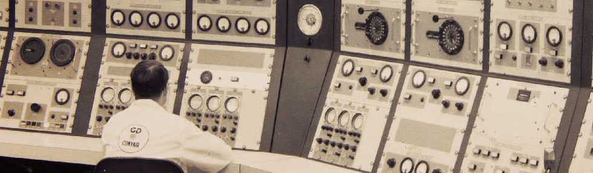

<!SLIDE title-slide>

# Monitoring - Not Just For Numbers

### Mikhail Panchenko

### Monitorama EU 9/19/2013

<!SLIDE>

# Hi!

My name is Pancakes.

I work @ **Opsmatic**

.notes I am working on better tools for operators at a company called Opsmatic.
This talk isn't really about that company, but it's about the thought process
that motivated us to start it and has guided our direction. We've been focusing
our attention on drift detection and how changes are tracked and communicated
under the broader premise that there is a lot of room for improvement in
tools for web and IT operators.

